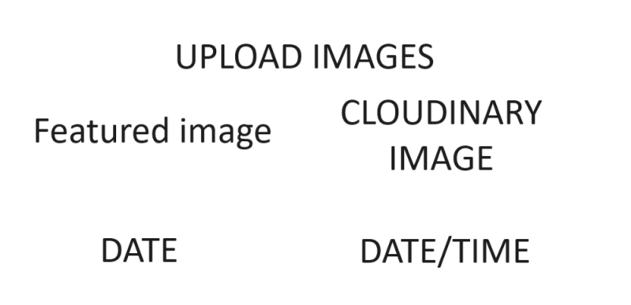
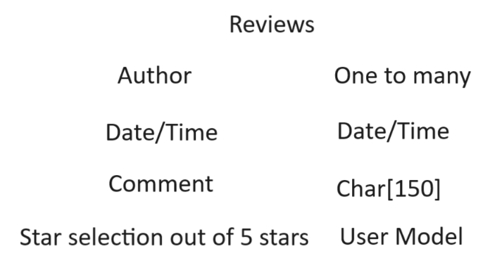

# Introduction

## Neon Demon Tattoo Studio

This is a front and backend website, that is designed to showcase a tattoo studio located in Wednesbury.
The idea is that people can visit the page and see all the work that has been done inside the shop and be able to contact
the shop about any tatto enquiries they can also use this site to view and even post their own reviews and experiences of the studio.

- The live deployment of this project is on Heroku [Neon Demon Tatoo](https://neondemontattoostudio-7b563027908c.herokuapp.com/)
  
- The repository for this project is on GitHub [Neon Demon Tatoo Repository](https://github.com/LiamEdwards931/NeonDemonPortfolioProject4?tab=readme-ov-file)
  
## Contents

- [Introduction](#introduction)
  - [Neon Demon Tattoo Studio](#neon-demon-tattoo-studio)
  - [Contents](#contents)
  - [Inspiration](#inspiration)
  - [User experience](#user-experience)
  - [Database model](#database-model)
  - [Flow chart of Neon Demon](#flow-chart-of-neon-demon)
  - [Bugs](#bugs)
  - [Credits](#credits)

## Inspiration

I was inspired to create this website at a request of the owner of this tattoo studio who recently opened shop,
the galleries and artists are created based on the people who work there,
my design was inspired by a project I attempted after my very first portfolio project which I unfortunately never finished:
    - First Neon Demon Tattoo Website attempt [First Neon Demon Website](https://liamedwards931.github.io/neon-demon/)

## User experience

I have listed some of the user stories in:

- [NeonDemonProjectRepository](https://github.com/users/LiamEdwards931/projects/4/views/1)
- As a user I would expect colours and style that represent the shop
- As a user I would expect to be able to know that I am on the right page for what I am looking for
- As a user I would expect a quick gallery on the home page to see some of the work that is done
- As a user I would expect a pricing section that explains the rates.
- As a user I would expect to see the shops branding on the website.
- As a user I would expect to see a clear navigation bar between the pages
- As a user I would expect a clear layout on any device.
- As a user I would expect to see the artists work
- As a user I would expect to see reviews about the shop whether on the page or externally like through google reviews.

## Database model

  The models I first set out to have changed slightly as this project progressed as new needs came to light as I was creating the project.
  
- Upload images model

  
  This model changed slightly to include the delete button and also the artist who uploaded the photo as I was creating it.
  
  This model stayed the same and didn't require me to make any additional changes.

## Flow chart of Neon Demon

Here is a flow chart mapping the user experience and admin experience of the website

## Bugs

- Issue with the database not reading, fixed by changing the config Vars in Heroku

## Credits

- W3 School for the CSS flicker effect on the landing page heading
