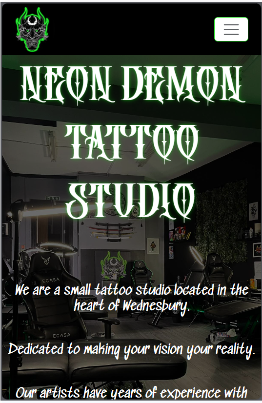

# Introduction

## Neon Demon Tattoo Studio

This is a front and backend website, that is designed to showcase a tattoo studio located in Wednesbury.
The idea is that people can visit the page and see all the work that has been done inside the shop and be able to contact
the shop about any tatto enquiries they can also use this site to view and even post their own reviews and experiences of the studio.

- The live deployment of this project is on Heroku [Neon Demon Tatoo](https://neondemontattoostudio-7b563027908c.herokuapp.com/)
  
- The repository for this project is on GitHub [Neon Demon Tatoo Repository](https://github.com/LiamEdwards931/NeonDemonPortfolioProject4?tab=readme-ov-file)
  
## Contents

- [Introduction](#introduction)
  - [Neon Demon Tattoo Studio](#neon-demon-tattoo-studio)
  - [Contents](#contents)
  - [Inspiration](#inspiration)
  - [Responsiveness](#responsiveness)
  - [User experience](#user-experience)
  - [Database model](#database-model)
  - [Flow chart of Neon Demon](#flow-chart-of-neon-demon)
  - [Features](#features)
    - [Landing page](#landing-page)
    - [base.html main page](#basehtml-main-page)
      - [header](#header)
      - [footer](#footer)
    - [about.html main page](#abouthtml-main-page)
      - [hero-image](#hero-image)
      - [cycling image container](#cycling-image-container)
      - [google map](#google-map)
    - [gallery.html](#galleryhtml)
      - [gallery.html normal user view](#galleryhtml-normal-user-view)
      - [gallery.html normal admin view](#galleryhtml-normal-admin-view)
  - [Bugs](#bugs)
  - [Credits](#credits)

## Inspiration

I was inspired to create this website at a request of the owner of this tattoo studio who recently opened shop,
the galleries and artists are created based on the people who work there,
my design was inspired by a project I attempted after my very first portfolio project which I unfortunately never finished:
    - First Neon Demon Tattoo Website attempt [First Neon Demon Website](https://liamedwards931.github.io/neon-demon/)

## Responsiveness

With the screenshots they were not rendering on the amiresponsive site so I have just screenshotted the generic sizes:

- Laptop L
  
  

- Laptop

- Tablet

- Mobile

## User experience

I have listed some of the user stories in:

- [NeonDemonProjectRepository](https://github.com/users/LiamEdwards931/projects/4/views/1)
- As a user I would expect colours and style that represent the shop
- As a user I would expect to be able to know that I am on the right page for what I am looking for
- As a user I would expect a quick gallery on the home page to see some of the work that is done
- As a user I would expect a pricing section that explains the rates.
- As a user I would expect to see the shops branding on the website.
- As a user I would expect to see a clear navigation bar between the pages
- As a user I would expect a clear layout on any device.
- As a user I would expect to see the artists work
- As a user I would expect to see reviews about the shop whether on the page or externally like through google reviews.

## Database model

  The models I first set out to have changed slightly as this project progressed as new needs came to light as I was creating the project.
  
- Upload images model

  
  
  This model changed slightly to include the delete button and also the artist who uploaded the photo as I was creating it.
  
- Review model
  
  
  
  This model stayed the same and didn't require me to make any additional changes.

## Flow chart of Neon Demon

Here is a flow chart mapping the user experience and admin experience of the website

## Features

### Landing page

The landing page is a simple page with a neon css styled header and an inviting button to enter the website,
Once the button is clicked some Javascript lifts the landing page up and renders the about.html page.

### base.html main page

The code with this page starts with base.html which only styles the header and the footer

#### header

The header has a link on the left which is the logo that takes you back to the landing should you wish to go there
The links on the right are styled with bootstrap turn green on hover, and they shrink into a button at a certain aspect ratio
This header is fixed to the top of the screen always so users have easy navigation at all times.

#### footer

The footer is always at the bottom of the screen no matter the screen size.
A banner for display purposes on bottom right, and all the social links location and contact for Neon Demon on the bottom right of the page.
the logo link in this footer also links to the login page for admin panel
The footer also changes style at a certain breakpoint as shown in the picture below:

  
### about.html main page

#### hero-image

in the about.html file you have the hero image, a landscape image containing the inside of the studio
this has a large h1 heading that is styled with animate css for a neon effect
I have also added content about the shop with 2 icons for contacting the studio

- one using email which when clicked automaticlly opens an email to neon demon (mail icon)

- one using facebook messenger (main site used to contact neon demon) this opens up a messenger chat straight to the neon demon page. (messenger icon)

#### cycling image container

The image container here appends any new images that are uploaded into the gallery they are assigned a class name which is targeted by javascript to cycle through every few seconds, I have a static image before this of the logo that just highlights the reel is starting over again.

  
#### google map

I have nested a google map in an iframe that highlights where neon demon is located so users can easily find the shop

### gallery.html

This page changes based on if you are logged in as an admin or if you are just a normal user

#### gallery.html normal user view

When you first enter the gallery page as a normal user you see

- it has an introduction, the consistent css styled neon header (using the same class name of 'neon')
- it has a layout of all the artists, a link to each of their galleries and a couple of lines about their specialty
- underneath this you have a layout of all the artists collective work:

- if no images have been uploaded for some reason the user will see this:
  

- if a user hovers over an image then it turns a slightly transparent black and displays who's tattoo it is and the style of it, purpose being if a user likes the photo they can migrate to that artists individual gallery.

#### gallery.html normal admin view

- if an admin is logged into the page depending on who is logged in they get a different display:

this shows the form created with the model to upload an image and add the style to it.
this form displays depending on the user so if aaron logged in this form would appear on his picture.
the reason for this is I needed to get the data for who uploaded the image and this was the best way i could think to do it.
it's also better ux for the admins.

## Bugs

- Issue with the database not reading, fixed by changing the config Vars in Heroku

## Credits

- W3 School for the CSS flicker effect on the landing page heading
