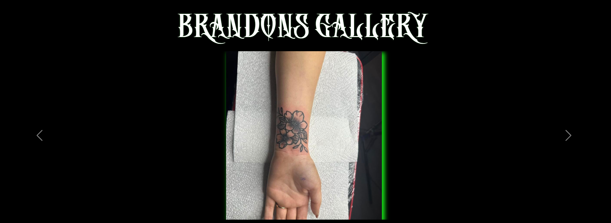

# Introduction

## Neon Demon Tattoo Studio

This is a front and backend website, that is designed to showcase a tattoo studio located in Wednesbury.
The idea is that people can visit the page and see all the work that has been done inside the shop and be able to contact
the shop about any tatto enquiries they can also use this site to view and even post their own reviews and experiences of the studio.

- The live deployment of this project is on Heroku [Neon Demon Tatoo](https://neondemontattoostudio-7b563027908c.herokuapp.com/)
  
- The repository for this project is on GitHub [Neon Demon Tatoo Repository](https://github.com/LiamEdwards931/NeonDemonPortfolioProject4?tab=readme-ov-file)
  
## Contents

- [Introduction](#introduction)
  - [Neon Demon Tattoo Studio](#neon-demon-tattoo-studio)
  - [Contents](#contents)
  - [Inspiration](#inspiration)
  -[Design](#design)
    -[Wireframes](#wireframes)
    -[Typography](#typography)
    -[Colour Scheme](#colour-scheme)
  - [Responsiveness](#responsiveness)
  - [User experience](#user-experience)
  - [Database model](#database-model)
  - [Model relationships](#model-relationships)
  - [Flow chart of Neon Demon](#flow-chart-of-neon-demon)
  - [Features](#features)
    - [Landing page](#landing-page)
    - [Base.html main page](#basehtml-main-page)
      - [favico](#favico)
      - [Header](#header)
      - [Footer](#footer)
    - [About.html main page](#abouthtml-main-page)
      - [Hero-image](#hero-image)
      - [Cycling image container](#cycling-image-container)
      - [Google map](#google-map)
    - [Gallery.html](#galleryhtml)
      - [Gallery.html user view](#galleryhtml-user-view)
        - [First impression of gallery.html](#first-impression-of-galleryhtml)
        - [Gallery display](#gallery-display)
        - [No images uploaded display](#no-images-uploaded-display)
        - [user hover on image](#user-hover-on-image)
      - [gallery.html admin view](#galleryhtml-admin-view)
        - [admin form](#admin-form)
        - [Successful upload](#successful-upload)
        - [placeholder](#placeholder)
        - [admin hover on image](#admin-hover-on-image)
      - [Individual artist page](#individual-artist-page)
        - [Carousel](#carousel)
        - [Artist Gallery](#artist-gallery)
    - [Reviews.html](#reviewshtml)
      - [review page with no review](#review-page-with-no-review)
      - [review form](#review-form)
      - [After review submitted page](#after-review-submitted-page)
        - [Large screen](#large-screen)
        - [Small screen](#small-screen)
    - [404 screen](#404-screen)
  - [Future Features](#future-features)
  - [Testing](#testing)
    - [Manual Testing Document](#manual-testing-document)
  - [Code Validation](#code-validation)
    - [HTML](#html)
    - [CSS](#css)
    - [Javascript](#javascript)
    - [Python](#python)
      - [Models.py](#modelspy)
      - [Views.py](#viewspy)
      - [Urls.py](#urlspy)
  - [Bugs](#bugs)
    - [Fixed Bugs](#fixed-bugs)
    - [Unfixed Bugs](#unfixed-bugs)
  - [Technology used](#technology-used)
  - [Languages used](#languages-used)
  - [Deployment](#deployment)
    - [Heroku](#heroku)
    - [Cloning a repository](#cloning-a-repository)
  - [Credits](#credits)
  - [Acknowledgments](#acknowledgments)

## Inspiration

I was inspired to create this website at a request of the owner of this tattoo studio who recently opened shop,
the galleries and artists are created based on the people who work there,
my design was inspired by a project I attempted after my very first portfolio project which I unfortunately never finished:
    - First Neon Demon Tattoo Website attempt [First Neon Demon Website](https://liamedwards931.github.io/neon-demon/)

## Design

### Wireframes

The wireframes were created using the website [Figma](https://www.figma.com/)

- Home page 

  

- About page

  

  

- Gallery page

  

- Review page

  

## Typography 

 - Two styles of font were used withing this project:
  - [Death Crow](https://www.cdnfonts.com/death-crow.font) - this font was primarily used for the headers as it aligned with the
  real life shops font they used for the banner on the studio. The majority of this font 
  
  - [Sedgwick Ave](https://fonts.google.com/specimen/Sedgwick+Ave?query=Sedgwick+Ave) The cursive style fit well for the artistic theme 
  I was going for within the website. This style was kept consistenly white behind the black backgrounds across all of the pages for all text content. 

## Colour Scheme

- The main theme of the website is black backgrounds with white text with neon green color: rgb(23, 224, 23); implemented for titles and borders.

- Using CSS animation and keyframes I created the infinte glow behind the titles to really emphasise the screens purpose and to further reinforce the "neon" in neon demon.

[Home](#introduction)

## Responsiveness

With the screenshots they were not rendering on the amiresponsive site so I have just screenshotted the generic sizes:

- Laptop L
  
  

- Laptop

- Tablet

- Mobile

[Home](#introduction)

## User experience

I have listed some of the user stories in:

- [NeonDemonProjectRepository](https://github.com/users/LiamEdwards931/projects/4/views/1)
- As a user I would expect colours and style that represent the shop
- As a user I would expect to be able to know that I am on the right page for what I am looking for
- As a user I would expect a quick gallery on the home page to see some of the work that is done
- As a user I would expect a pricing section that explains the rates.
- As a user I would expect to see the shops branding on the website.
- As a user I would expect to see a clear navigation bar between the pages
- As a user I would expect a clear layout on any device.
- As a user I would expect to see the artists work
- As a user I would expect to see reviews about the shop whether on the page or externally like through google reviews.

[Home](#introduction)

## Model relationships

There are 2 main models within this application
  - Upload image
  - Reviews

Both models within this project have foreign keys to the user, however both models are not accessible by a regular user and the upload image model is only available to superusers.

Upload image is for superusers to be able to upload an image to the gallery, this takes the foreign key of the user and adds the name of that user to the uploaded picture, furthermore at point of uploading the user is required to add a brief snippet for the style of the image to make it easy for users to see what style of work has been done. The images uploaded from this model are then pushed into the gallery available for any user to see.

Review is for any user to have the the ability to add a review to the website, The user is required to submit a number between 1-5 to give the shop a rating and also submit some content in the field available, once it has been submit the users name will be appended to the review along with time and date of the submission. 

[Home](#introduction)

## Flow chart of Neon Demon

Here is a flow chart mapping the user experience and admin experience of the website.

Once an image has been uploaded in the gallery by a superuser, the image is also apppended to the about.html page and depending on the superuser logged in that same image gets appended into their own personal gallery also.

[Home](#introduction)
  
## Features

### Landing page

The landing page is a simple page with a neon css styled header and an inviting button to enter the website,
Once the button is clicked some Javascript lifts the landing page up and renders the about.html page.

### Base.html main page

The code with this page starts with base.html which only styles the header, footer and favico

#### favico

#### Header

The header has a link on the left which is the logo that takes you back to the landing should you wish to go there
The links on the right are styled with bootstrap turn green on hover, and they shrink into a button at a certain aspect ratio
This header is fixed to the top of the screen always so users have easy navigation at all times.

#### Footer

The footer is always at the bottom of the screen no matter the screen size.
A banner for display purposes on bottom right, and all the social links location and contact for Neon Demon on the bottom right of the page.
the logo link in this footer also links to the login page for admin panel
The footer also changes style at a certain breakpoint as shown in the picture below:

  
### About.html main page

#### Hero-image

in the about.html file you have the hero image, a landscape image containing the inside of the studio
this has a large h1 heading that is styled with animate css for a neon effect
I have also added content about the shop with 2 icons for contacting the studio

- one using email which when clicked automaticlly opens an email to neon demon (mail icon)

- one using facebook messenger (main site used to contact neon demon) this opens up a messenger chat straight to the neon demon page. (messenger icon)

#### Cycling image container

The image container here appends any new images that are uploaded into the gallery they are assigned a class name which is targeted by javascript to cycle through every few seconds, I have a static image before this of the logo that just highlights the reel is starting over again.

  
#### Google map

I have nested a google map in an iframe that highlights where neon demon is located so users can easily find the shop

### Gallery.html

This page changes based on if you are logged in as an admin or if you are just a normal user

#### Gallery.html user view

##### First impression of gallery.html

When you first enter the gallery page as a normal user you see

- it has an introduction, the consistent css styled neon header (using the same class name of 'neon')
- it has a layout of all the artists, a link to each of their galleries and a couple of lines about their specialty
  
##### Gallery display

- Underneath this you have a layout of all the artists collective work:

- Images are displayed newest to oldest, newest being on the left.

##### No images uploaded display

- if no images have been uploaded for some reason the user will see this:
  

##### user hover on image

- if a user hovers over an image then it turns a slightly transparent black and displays who's tattoo it is and the style of it, purpose being if a user likes the photo they can migrate to that artists individual gallery.

#### gallery.html admin view

- if an admin is logged into the page depending on who is logged in they get a different display:

##### admin form

this shows the form created with the model to upload an image and add the style to it.
this form displays depending on the user so if aaron logged in this form would appear on his picture.
the reason for this is I needed to get the data for who uploaded the image and this was the best way i could think to do it.
it's also better ux for the admins.

Any photos uploaded here get pushed into the image container on the about.html page

##### Successful upload

- When an image is uploaded a message will pop up either saying the image was successfully uploaded or it was unsuccessful
  

##### placeholder

- when any admin is logged in they will get a placeholder for where the next image they upload is going to be placed:
  

##### admin hover on image

- when an admin hovers over an uploaded gallery image that they personally have uploaded when they hover over a gallery image, a delete button appears

- This also has a message to say that the image has been successfully deleted

When an image is deleted from the gallery it is also removed from the about.html image container and will no longer display on the page.

#### Individual artist page

- Each one of the arists gallery behave and look exactly the same in the README I will show you one example of the page. 
- The only difference between them is the images that get moved into them.

##### Carousel

- the style of the header is consistent with other pages
- the image uploaded by brandon in this case is displayed in a bootstrap carousel, the same would appear on the other artist gallery had they been the one to upload their image.
- The carousel is automatic and manual, so it will consistently flick through the images but you can click the button either side to manually change the images.
  
##### Artist Gallery

- I wanted to create a better UX and not force a user to flick through the carousel to find tattoo images
- The images uploaded by the specific admin are also uploaded into a similar style to the gallery.html aswell

- As already stated each artists page behaves in the exact same way depending on who logs in
if aaron logs in through the admin panel and uploads an image it goes into:
- gallery.html
- about.html image container
- aaron.html in the carousel and the personal gallery
  
### Reviews.html

- The review page starts with an introduction and 2 links that take you to google reviews and facebook reviews
- A button that allows you to leave a review on the reviews.html page
- If no reviews have been posted then a message that says so.

#### review page with no review

- When the button is pressed it takes you to reviewform.html
- If you enter a number that is out of the range specified you get the error message as shown in the screenshot.
- Each part of the form has placeholder text to ensure you know how to fill it out properly.

#### review form

- Email validaton - the input checks for the right format of email or you get an error message
- This is in place to deter people from leaving false or fake reviews.

#### After review submitted page

- Each review starts on the right and displays horizontally, going in date order.
- This is responsive on mobiles and all displays are verticle on smaller screens.
  
##### Large screen

Large screen

- If statement in place to change the int value to a star value on the html page for rating
- Shows the content of the review
- Shows who posted the review
- Shows the date and time the review was posted

##### Small screen

Small Screen

Final word on the review section these can be deleted via the admin page however, I wanted to create an authentic honest feedback system for the tattoo studio and decided against it, as feedback can be constructive and used as opportunity for growth so cherrypicking the reviews you want went against that philosophy.

### 404 screen

- This screen displays if there is a 404 error within the website
- Displays exactly like the landing page except with the error message
- has a button to take you back to the about.html page.

[Home](#introduction)

## Future Features

- Some future features for this project will include:
  
  - A commerce page that contains the merchandise that neon demon sell
  - A page that highlights the sponsers for neondemon for extra promotions toward the studio.

## Testing

### Manual Testing Document
  
Full documentation for each of the webpages and their features are all located in the link below:

- The link to the testing document is [here](TESTING.md)

[Home](#introduction)

## Code Validation

### HTML

Ran the HTML validator code that returned Errors: however these errors are django syntax related and the data missing is found in base.html or bad src values for .
1 warning about a section with no header, but that section does start with a div so a header isn't necessary.

Most validation errors within my HTML are caused from django syntax and the html validator not recognising them.

### CSS

No CSS issues when going through the validator

### Javascript

Went through JSHint validator with minor issues

### Python

#### Models.py

Went through [pep8](https://www.pythonchecker.com/) with no significant issues.

#### Views.py

Went through [pep8](https://www.pythonchecker.com/) with no significant issues.

#### Urls.py

Went through [pep8](https://www.pythonchecker.com/) with no significant issues.
Main ones addressed were it was asking to put a space between the url name and the '/'
e.g: base/

[Home](#introduction)

## Bugs

### Fixed Bugs

- Bug with the database not reading,
  - I Was getting console errors stating that it could not be read
    - Fixed by changing the config Vars in Heroku to the correct paths

- Bug with the  tags not rendering the content in them
  - The issue was I had not specified a block content section within the base.html file
    - Added a block content section in the base.html and it started to render the content.

- Bug with there being a large space on the right hand side of the about.html page on large screens
  - The issue was the container holding the artist images breakpoint hand't kicked in yet, resulting in the extra space being needed compared to the other elements on the page
    - Fixed by adding in another bootstrap class to handle the responsiveness of the artist container.

- Bug with the command ~ Migrate not running properly after defining the uploaded_by model as 'default cannot be a STR'
  - The issue was I had prepped the model in 'makemigrations' with the default as a string when it needed to be the superusers ID as a integer.
    - Fixed by rolling back the migrations to a previous version, amending the model to fetch the superuser ID and passed that as the default placeholder and re-migrated.

- Bug with background Images not loading when deploying to Heroku
  - The issue was the static files in CSS were not rendering in the live deployment or with DEBUG=FALSE
    - Fixed by using style tags in the head of each file to use the syntax: background: url ('')
    - I prefered this way as opposed to using inline styling as it looked cleaner.

### Unfixed Bugs

- As far as I am aware there are no unfixed bugs in this project, I have extensively tested the functionality of the site and have it all documented in the [test_section](TESTING.md)

[Home](#introduction)

## Technology used

This website was created using:

- Django
- Javascript
- Bootstrap
- HTML
- CSS
- GUNICORN
- PYSCOPG
- Elephant SQL
- Cloudinary

## Languages used

- Javascript
- HTML
- CSS
- Python

[Home](#introduction)

## Deployment

### Heroku

This project is deployed with Heroku - the steps to deploy are as follows:
- Sign in and click "Create new app"

- Name your project and select you region:

- In the settings tab Add your config vars in this case:
  - Cloudinary
  - database
  - secret_key

- Go to deploy and connect your repository for your project using the GitHub Option

- Once you have connected deploy from main branch - choose "automatic updates if you want to update as you work on your project" if not press deploy at the bottom

- Neon Demon Tattoo site is deployed through Heroku the live deployment is here: [NeonDemonTattoo](https://neondemontattoostudio-7b563027908c.herokuapp.com/)

### Cloning a repository

1. On your GitHub repository navigate to your repository page.
2. Click on the green button with "CODE" written in it.
3. Go to the HTTPS and copy the URL by pressing the overlapping squares.
4. Open Git Bash.
5. Enter git clone followed by the copied URL.
6. Enter where you would like your repository to be saved too for your local file.
7. Press Enter to finalise the clone.

[home](#introduction)

## Credits

- W3 School for the CSS flicker effect on the landing page heading:

[Neontext-url](https://www.w3schools.com/howto/howto_css_glowing_text.asp)

- Youtube for how to desing the landing page:

[youtube](https://www.google.com/search?sca_esv=589119146&sxsrf=AM9HkKk3WY1kggV8_EjQ0NbLHmgpTYhItQ:1703631749544&q=bootstrap+landing+page&tbm=vid&source=lnms&sa=X&ved=2ahUKEwiVwInqmq6DAxXpQUEAHYZuACIQ0pQJegQIDRAB&biw=1488&bih=742&dpr=1.25#fpstate=ive&vld=cid:e88ad343,vid:DvfezgoBRzY,st:0)

- StackOverflow for some syntax and migrate issues I was having as stated earlier:

[stackoverflow](https://stackoverflow.com/questions/36809775/django-models-cant-migrate)

- Youtube tutorial for a better understanding on how django works- helped with the set up:

[youtube](https://www.youtube.com/watch?v=rHux0gMZ3Eg&list=PLCU-bTo00FtjtzBgVUHt-Z1K9V8ASOkjg&index=3&t=2159s)

- Some help with the upload image model with a youtube video

[youtube](https://www.youtube.com/watch?v=O5YkEFLXcRg&t=34s)

## Acknowledgments

- This project was created for the level 3 diploma Full Stack Developer with the [Code Institute](https://codeinstitute.net/full-stack-software-development-diploma/?utm_term=code%20institute&utm_campaign=CI+-+UK+-+Search+-+Brand&utm_source=adwords&utm_medium=ppc&hsa_acc=8983321581&hsa_cam=1578649861&hsa_grp=62188641240&hsa_ad=635720257674&hsa_src=g&hsa_tgt=kwd-319867646331&hsa_kw=code%20institute&hsa_mt=e&hsa_net=adwords&hsa_ver=3&gad=1&gclid=CjwKCAjw67ajBhAVEiwA2g_jEKYbx7CDH4ExZGh3udf-5qh-Ee91R2MXr7F5M4UdbdDhV-c-QZ-_zxoCyW4QAvD_BwE)

- Thanks to my mentor [Precious ljge ](https://www.linkedin.com/in/precious-ijege-908a00168/) for the constructive feedback of this project.

Liam Edwards 2023.
[Home](#introduction)
